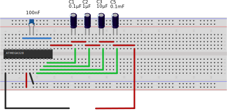

# Resistance-Measurement
Measuring resistance (and conductivity) via a discharging capacitor with an AVR.

Requirements:
* avrdude
* avr-gcc

The Makefile assumes you are using an Atmega328P and would like to upload via an usbtiny AVR programmer through USB.

The circuit:

