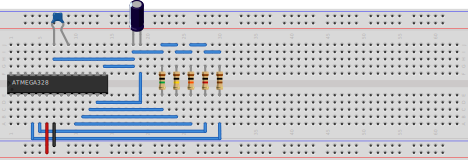

# Capacitance-Measurement
Measuring capacitance by dischargement over a known resistor

Requirements:
* avrdude
* avr-gcc

The Makefile assumes you are using an Atmega328P and would like to upload via an usbasp AVR programmer through USB.

The circuit:

